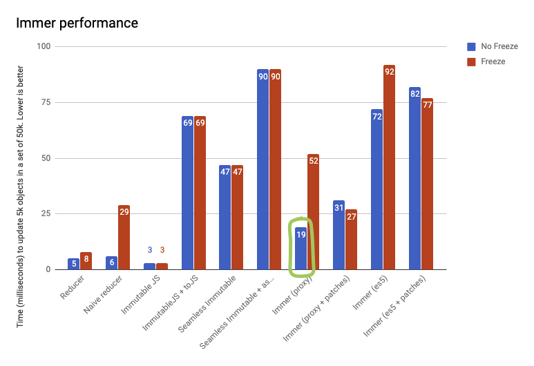

# Immer

**用于创建不可变数据，只需要通过修改当前的state，便可以创建出下一个不可变的state，并且旧的state并不会跟着改变**

## 用法

### produce api 普通用法

```js
import produce from 'immer'

const state = {
  k1: 1,
  k2: {
    kk: 1,
    arr: [1, 2, 3]
  }
}

const nextState = produce(state, draft => {
  draft.k1 = 2
  return draft
})

/*
nextState -> {
  k1: 2,
  k2: {
    kk: 1,
    arr: [1, 2, 3]
  }
}
*/
// state 保持不变
console.log(state.k2 === nextState.k2) // true 不做修改的数据结构会被共享
```

### produce api curry 用法

```js
import React from 'react'
import produce from 'immer'

export default class Example extends React.Component {
  constructor () {
    this.state = {
      k1: 1,
      k2: {
        kk: 1,
        arr: [1, 2, 3]
      }
    }
  },
  doSomthing () {
    // 返回一个curried函数
    const changeState = produce(draft => {
      draft.k2.arr.push(4)
    })
    this.setState(changeState)
  }
  render () {
    // ...
  }
}
```

`immer` 可以大大简化了“冗余”的浅拷贝代码，开发者可以更关注数据修改本身，随着数据结构的复杂这一点会越发明显。


## 原理

> **维护一份`state`,在内部挟持所有操作，判断是否发生改变再决定如何返回最终结果**

### 1. 使用Proxy对入参state做挟持

```js
function produce(base, recipe, patchesListener) {
  // curry
  if (typeof base === "function" && typeof recipe !== "function") {
    var defaultBase = recipe;
    recipe = base;
    var self = this;
    return function curriedProduce(base) {
      var _this = this;

      if (base === void 0) {
        base = defaultBase;
      }

      for (var _len = arguments.length, args = new Array(_len > 1 ? _len - 1 : 0), _key = 1; _key < _len; _key++) {
        args[_key - 1] = arguments[_key];
      }

      return self.produce(base, function (draft) {
        var _recipe;

        return (_recipe = recipe).call.apply(_recipe, [_this, draft].concat(args));
      }); // prettier-ignore
    };
  }

  var result;
  // Only plain objects, arrays, and "immerable、classes" are drafted.
  if (isDraftable(base)) {
    // 创建scope，用于保存一些变量，在produce整个过程中用到的scope是同一个
    var scope = enterScope(this);
    // 挟持state的get、set等操作
    var proxy = createProxy(this, base, undefined);
    var hasError = true;

    try {
      // 执行我们的函数
      result = recipe(proxy);
      hasError = false;
    } finally {
      // finally instead of catch + rethrow better preserves original stack
      if (hasError) revokeScope(scope);else leaveScope(scope);
    }

    if (typeof Promise !== "undefined" && result instanceof Promise) {
      // promise的方式在then后处理
      return result.then(function (result) {
        return processResult(result, scope);
      }, function (error) {
        revokeScope(scope);
        throw error;
      });
    }
    // 处理我们函数的返回结果
    return processResult(result, scope);
  }
};
const state: ProxyState = {
  type_: isArray ? ProxyTypeProxyArray : (ProxyTypeProxyObject as any),
  // Track which produce call this is associated with.
  scope_: parent ? parent.scope_ : getCurrentScope()!,
  // True for both shallow and deep changes.
  modified_: false,
  // Used during finalization.
  finalized_: false,
  // Track which properties have been assigned (true) or deleted (false).
  assigned_: {},
  // The parent draft state.
  parent_: parent,
  // The base state.
  base_: base,
  // The base proxy.
  draft_: null as any, // set below
  // The base copy with any updated values.
  copy_: null
}
```

`immer` 会对state做一层挟持，结构大概如上，各个属性的含义如下
`type_`：代表代理的`state`类型，`Array`和`Object`有不同的处理方式
`scope_`：用于保存`produce`函数调用期间与之关联的一些变量，`modified_`：记录当前是否有修改，如果有修改，返回copy部分，没有修改返回base部分
`finalized_`：记录当前proxy是否已经定案，在所有的修改完成后，需要对其草稿定案，也就是将`copy_`上的所有`proxy`转出普通的对象
`assigned_`：记录被修改的key，
`parent_`：当前`state`的`parent state`，
`base_`：保存被代理的state，
`draft_`：是被代理后的`state`，
`copy_`：当值被修改时，对`base`做一次shallow copy，真实的修改保存在此，可能是`proxy`类型，当存在多层嵌套的修改时，需要对访问到每一层做`proxy`处理。

### 2. get、set

挟持了`get`、和`set`操作后，当触发`get`操作时，当访问的`prop`是引用类型，需要对其再做一层`proxy`，从而实现多层的嵌套修改，当触发`set`操作时，将`base`做shallowCopy到`copy_`，将修改保存在`copy_`上

```js
var objectTraps = {
  // draft.k1 = 1
  // draft.a.b = 2
  get: function get(state, prop) {
    // DRAFT_STATE是用于获取proxy上的当前state
    if (prop === DRAFT_STATE) return state;
    var source = latest(state); // state.copy_ || state.base_

    if (!has(source, prop)) {
      // non-existing or non-own property...
      // 不存在的prop尝试从原型链上取
      return readPropFromProto(state, source, prop);
    }

    // 拿到当前的值
    var value = source[prop];

    // 如果已经定案，或者不可以被draft（只有对象和数组可以被draft）
    if (state.finalized_ || !isDraftable(value)) {
      return value;
    }

    // 如果当前的值是引用类型，而且是base_上的属性，这个时候需要对其做proxy处理，保存到copy_上，因为这样才能直接多层的嵌套修改，
    // 比如：draft.a.b = 2，
    // draft.a会触发当前的get函数，而a.b的操作并没有被挟持，所以需要处理
    if (value === peek(state.base_, prop)) {
      prepareCopy(state);
      return state.copy_[prop] = createProxy(state.scope_.immer_, value, state);
    }

    return value;
  },
  set: function set(state, prop
  /* strictly not, but helps TS */
  , value) {
    // draft.k1 = 2
    var desc = getDescriptorFromProto(latest(state), prop);

    if (desc === null || desc === void 0 ? void 0 : desc.set) {
      // special case: if this write is captured by a setter, we have
      // to trigger it with the correct context
      // 如果属性存在自己的set操作，调用其set操作
      desc.set.call(state.draft_, value);
      return true;
    }

    // 记录当前属性被修改
    state.assigned_[prop] = true;

    if (!state.modified_) {
      // the last check is because we need to be able to distinguish setting a non-existig to undefined (which is a change)
      // from setting an existing property with value undefined to undefined (which is not a change)
      // 如果value和原来的值相同，直接返回
      if (is(value, peek(latest(state), prop)) && (value !== undefined || has(state.base_, prop))) return true;
      // 将base拷贝，递归记录当前state的modified_状态
      prepareCopy(state);
      markChanged(state);
    } // @ts-ignore

    // 新值保存到copy_上
    state.copy_[prop] = value;
    return true;
  }
}
```

### 3. finalize

将`draft finalize`，如果`state`发生了变化，返回`copy_`，没有变化则返回`base_`

```js
function processResult(result, scope) {
  // result是函数返回值
  scope.unfinalizedDrafts_ = scope.drafts_.length;
  var baseDraft = scope.drafts_[0];
  var isReplaced = result !== undefined && result !== baseDraft;
  if (!scope.immer_.useProxies_) getPlugin("ES5").willFinalizeES5_(scope, result, isReplaced);

  if (isReplaced) {
    if (isDraftable(result)) {
      // Finalize the result in case it contains (or is) a subset of the draft.
      result = finalize(scope, result);
    }
  } else {
    // Finalize the base draft.
    result = finalize(scope, baseDraft, []);
  }

  revokeScope(scope);
  return result !== NOTHING ? result : undefined;
}

function finalize(rootScope, value, path) {
  //拿到 proxy对象
  var state = value[DRAFT_STATE];

  if (!state) {
    return value;
  }

  // 没有修改返回原来的state
  if (!state.modified_) {
    return state.base_;
  } // Not finalized yet, let's do that now


  if (!state.finalized_) {
    state.finalized_ = true;
    state.scope_.unfinalizedDrafts_--;
    var result = state.type_ === ProxyTypeES5Object || state.type_ === ProxyTypeES5Array ? state.copy_ = shallowCopy(state.draft_) : state.copy_; // Finalize all children of the copy

    // 遍历_copy上的所有prop
    each(result, function (key, childValue) {
      return finalizeProperty(rootScope, state, result, key, childValue, path);
    });
  }

  return state.copy_;
}

// draft.k1.k2 = 2
function finalizeProperty(rootScope, parentState, targetObject, prop, childValue, rootPath) {
  if (isDraft(childValue)) {
    // 修改路径 比如['k1','k2']
    var path = rootPath && parentState && parentState.type_ !== ProxyTypeSet && !has(parentState.assigned_, prop)
    ? rootPath.concat(prop) : undefined;

    var res = finalize(rootScope, childValue, path);
    set(targetObject, prop, res);

    if (!isDraft(res)) {
      return
    }
  }

  if (isDraftable(childValue)) {
    finalize(rootScope, childValue);
  }
}
```

## 在feed项目中使用

```js
[setActiveTab]: (state, { payload: { tabId } }) => {
  return {
    ...state,
    tabs: {
      ...state.tabs,
      activeTab: tabId
    }
  }
}

[setActiveTab]: (state, { payload: { tabId } }) => {
  return produce(state, draft => {
    draft.tabs.activeTab = tabId
  })
}
```

基本没有学习成本，可以减少冗余的解构模板代码，修改更加直观，而且可以防止可能因为一些不必要的解构带来的数据变化导致 `render`，没有修改部分 `immer` 会复用，可以结合 `pureComponent` 或者 `shouldComponentUpdate` 使用减少不需要的 `render`

## 性能



这里显示的是在50k的数据里修改了5k的数据所需要的时间，而且大部分测试用例是最坏的情况下

我们可以只看蓝色的柱子，freeze的在生产环境不会开启不需要关心其性能

reducer：指我们手动通过 `​...`​ 或者 ​`Object.assign`​ 这类原生 `immutable API` 来处理我们的数据。

Immutable js: 指我们通过 `immutable-js` 来操作数据。`toJS` 指将内置的 `immutable-js` 对象转化为原生 js 内容。

Immer: 分别测试了在支持 `Proxy` 的环境和在不支持 `Proxy` 使用 `defineProperty` 环境下的数据。

在使用`proxy`的情况下，比手写`reducer`慢2-3倍，这里大部分的测试用例是一些极端情况，实际可以忽略。

在不支持`proxy`的环境中，速度明显较低，性能会比使用`proxy`的差3倍，在某些情况下可能更糟

By default produce tries to use proxies for optimal performance. However, on older JavaScript engines Proxy is not available. For example, when running Microsoft Internet Explorer or React Native (if < v0.59 or when using the Hermes engine) on Android. In such cases, Immer will fallback to an ES5 compatible implementation which works identically, but is a bit slower.

## 总结

`immer` 的api简单，几乎没有学习成本，对项目的改造也比较容易。但是运行效率受环境影响，在不支持 `proxy` 的环境中运行较慢

