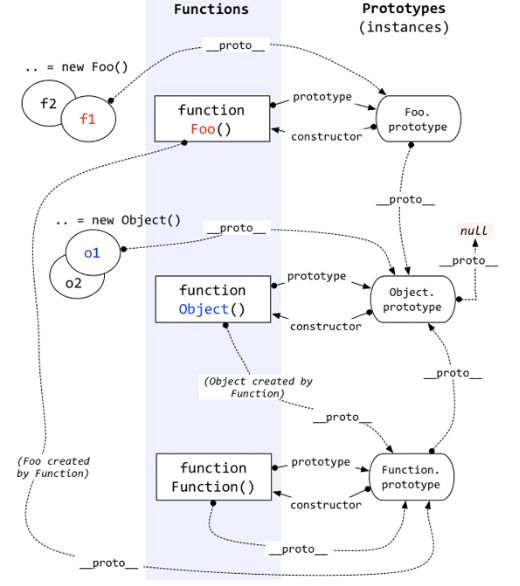

+ 浏览器渲染(输入url后的流程 重排 重绘)
  - [重排重绘](https://juejin.im/post/5a9923e9518825558251c96a?utm_source=gold_browser_extension)
  - [输入url后的整个过程](https://www.jianshu.com/p/9075ee83b679)
  - [css不会阻塞dom解析，但会阻塞dom渲染，也会阻塞js执行](https://blog.csdn.net/github_39133192/article/details/74560891)
  - [js会阻塞dom解析，也会阻塞dom渲染]
  - [async defer](https://segmentfault.com/q/1010000000640869)
  - [从浏览器多进程到JS单线程，JS运行机制最全面的一次梳理](https://juejin.im/post/5a6547d0f265da3e283a1df7?utm_medium=fe&utm_source=weixinqun)
  - [图层](web.jobbole.com/83575/)

+ 缓存
  - [缓存](https://my.oschina.net/leejun2005/blog/369148)
  - [缓存](http://blog.csdn.net/jiana227/article/details/7732227)
  - [google http chche](https://developers.google.com/web/fundamentals/performance/optimizing-content-efficiency/http-caching?hl=zh-cn)

+ 优化
  - [雅虎35规则](https://github.com/creeperyang/blog/issues/1)
  - [优化](https://www.zhihu.com/question/21658448)
  - [WebView性能、体验分析与优化](https://tech.meituan.com/WebViewPerf.html)
  - [VasSonic](https://www.jianshu.com/p/0fbd4a57b553)
  - [preload](https://www.jianshu.com/p/24ffa6d45087)

+ es6 module和commonjs区别
  - [blog](https://github.com/ShowJoy-com/showjoy-blog/issues/39)
  - [You can mix require and export. You can't mix import and module.exports.](https://github.com/webpack/webpack/issues/4039)

+ xss csrf webshell ifarme sql注入 远程代码执行 上传漏洞
  - [安全](http://web.jobbole.com/92875/)
  - [安全](http://web.jobbole.com/92893/)

+ 强缓存和弱缓存

+ https
  - [ssl连接过程](http://www.ruanyifeng.com/blog/2014/09/illustration-ssl.html)

+ Event Loop
  - [setTimeout setImmediate nextTick](https://segmentfault.com/a/1190000008595101)
  - [event loop](http://www.ruanyifeng.com/blog/2014/10/event-loop.html)
  - [事件循环进阶：macrotask与microtask](https://jakearchibald.com/2015/tasks-microtasks-queues-and-schedules/)
+ css居中

+ css选择器权重
  - [权重](https://www.cnblogs.com/dq-Leung/p/4213375.html)

+ 负margin布局

+ margin无法撑开 BFC
  - [https://www.jianshu.com/p/fc1d61dace7b](https://www.jianshu.com/p/fc1d61dace7b)

+ 闭包
  - [闭包](https://www.zhihu.com/question/34210214)

+ flex grid

+ 图片优化（压缩 base64 缓存 响应式[srcset] 预加载 懒加载）

+ 大数
  - [number encoding](http://2ality.com/2012/04/number-encoding.html)
  - [双精度浮点数](https://zh.wikipedia.org/wiki/%E9%9B%99%E7%B2%BE%E5%BA%A6%E6%B5%AE%E9%BB%9E%E6%95%B8)
  - [0.1 + 0.2 !== 0.3](https://www.zhihu.com/question/24415787)
  - [Here is what you need to know about JavaScript’s Number type](https://medium.com/dailyjs/javascripts-number-type-8d59199db1b6)
  - [Here is what you need to know about JavaScript’s Number type 中文版](https://genuifx.github.io/2018/04/17/here-is-what-you-need-to-know-about-javasciprt-number-type/)

+ http2 socket

+ css4

+ 原型继承 es678
  - 原型关系图
  
  - [基于构造函数继承](http://www.ruanyifeng.com/blog/2010/05/object-oriented_javascript_inheritance.html)
  - [非构造函数的继承](http://www.ruanyifeng.com/blog/2010/05/object-oriented_javascript_inheritance_continued.html)

+ Immutable
  - [使用immutable.js优化react程序，内部使用共享结构，使得diff过程更快结束](https://jlongster.com/Using-Immutable-Data-Structures-in-JavaScript)

+ 类型转换
  - [隐式转换 valueOf toString](http://frontenddev.org/link/conversion-of-tostring-and-the-valueof-javascript-object.html)
  - [双等号比较过程](https://segmentfault.com/a/1190000008038751)

+ 基本算法
  - [快排](http://www.ruanyifeng.com/blog/2011/04/quicksort_in_javascript.html)
  - [树递归]()
  - [链表](https://juejin.im/entry/59cb70995188256aa423b680)
  - [快排优化](https://blog.csdn.net/msdnwolaile/article/details/52133674)
  - [插入排序](https://zh.wikipedia.org/wiki/%E6%8F%92%E5%85%A5%E6%8E%92%E5%BA%8F)
  - [希尔排序](https://zh.wikipedia.org/wiki/%E5%B8%8C%E5%B0%94%E6%8E%92%E5%BA%8F)

+ vue 生命周期 vdom 双向绑定
  - [diff算法](https://segmentfault.com/a/1190000008782928)
  - [vdom](https://segmentfault.com/a/1190000013469565)
  - [diff算法](https://blog.csdn.net/u010692018/article/details/78799335)

+ http协议 各种头
  - content-length  大小
  - content-type  数据类型
  - connection: keep-alive
  - cache-control: max-age=0 | no-chche | 
  - accept-encoding: gzip
  - accept-language: 
  - Transfer-Encoding: chunked
  - expires: 
  - last modified(响应头)/if modified since(请求头) (配合cache-control使用)
  - etag(响应头)/if none match(请求头) (配合cache-control使用)

+ 常见方法
  - Curry deepcopy debounce throttle 

+ 组件库亮点
  - 更有扩展性，比如table的排序可自定义  过滤可自定义  form支持响应式布局
  - 打包体积更小  rollup
  - 内置的依赖组件也更灵活，可以自定义  充分利用v-bind语法
  - 功能更丰富 比如modal支持拖拽
  - 更友好的开发体验，开发环境的错误提示
  - 某些实现更优雅 比如像modal等组件可能会存在遮罩，这个遮罩大多是相同的，所以可以共用一个遮罩
  - 

+ 为什么离职
  - 为什么离职
  - bat给你offer，你怎么选
  - 进来做的工作 发展空间 企业的重点发展方向是不是在
